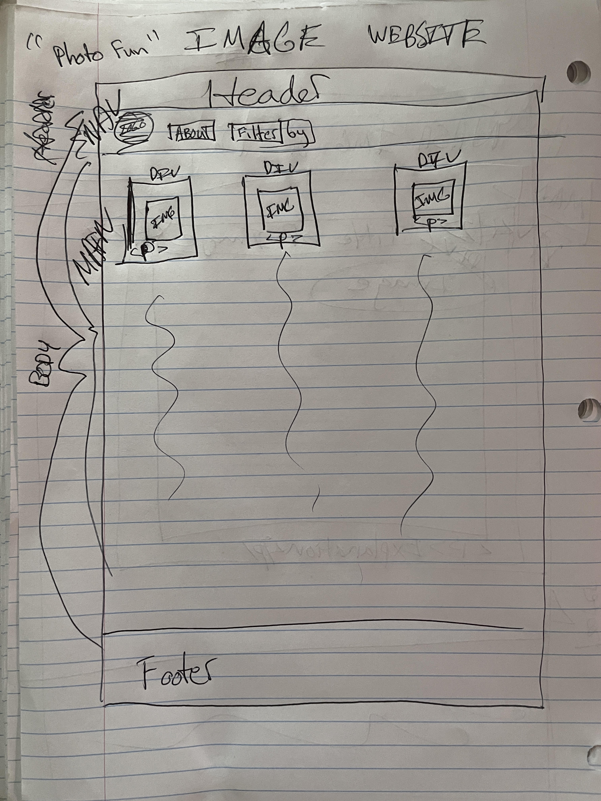

# Photography Fun

## Description
I am buidling this simple layout website to help strengthen my css skills with images. Noticiing it as one of my weaknesses I hope to learn more with Flexbox and reinforce populating the DOM with javascript skills that I've learned from Nashville Software School. 

It's also a fun way to catalog my better shots "mostly" taken on film while traveling as a professional musician. :musical_note: :drum: :musical_note:

### Wireframe

##### Contributors
[Wesley Mitchell](https://github.com/wes-mitchell)